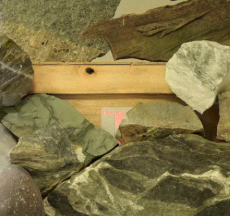

# Colorization in Monochrome-Color Dual-Lens System
Pytorch implementation of "[Learning a Deep Convolutional Network for Colorization in Monochrome-Color Dual-Lens System (AAAI 2019)](https://ojs.aaai.org//index.php/AAAI/article/view/4837)"

## Demo
#### Middlebury
| Mono Left Image                          | Predict                                 | Ground Truth                          | Mono Left Image                          | Predict                                 | Ground Truth                          |
| ---------------------------------------- | --------------------------------------- | ------------------------------------- | ---------------------------------------- | --------------------------------------- | ------------------------------------- |
|  |  |  |  |  |  |
|  |  |  |   |   |   |

#### SceneFlow
| Mono Left Image                        | Predict                               | Ground Truth                        | Mono Left Image                        | Predict                               | Ground Truth                        |
| -------------------------------------- | ------------------------------------- | ----------------------------------- | -------------------------------------- | ------------------------------------- | ----------------------------------- |
|  |  |  |  |  |  |
|  |  |  |  |  |  |

